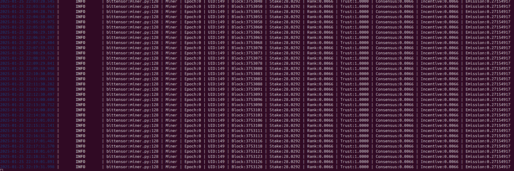
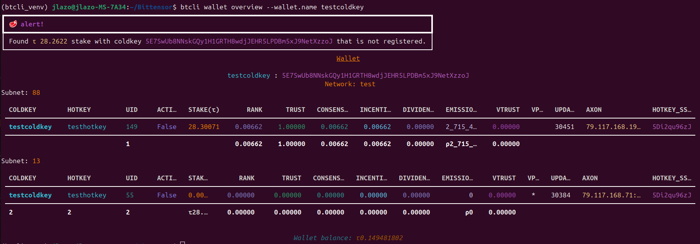

# **[OpenKaito](https://www.kaito.ai/) `testnet` Mining Guide**
This guide details the steps necessary to start mining on the [Bittensor](https://bittensor.com/) `testnet`. Specifically on the `subnet` `5` called [OpenKaito](https://www.kaito.ai/) which is located in the `netuid` `88` in the `testnet`. You can find the repository of OpenKaito [here](https://github.com/OpenKaito/openkaito).

---

## **Table of Contents**
1. [Introduction](#1-introduction)
2. [System Requirements](#2-system-requirements)
    1. [Hardware requirements](#21-hardware-requirements)
    2. [Software requirements](#22-software-requirements)
3. [Installation](#3-installation)
    1. [Get started in Bittensor](#31-get-started-in-bittensor)
    2. [Install Bittensor CLI](#32-install-bittensor-cli)
    3. [Create Wallet](#33-create-wallet)
    4. [Import Wallet](#34-import-wallet)
    5. [Install Bittensor SDK](#35-install-bittensor-sdk)
    6. [Install Wallet SDK](#36-install-bittensor-wallet-sdk)
<!--- 4. [Configuration](#configuration)
6. [Monitoring and Logs](#monitoring-and-logs)
7. [Tips for Optimization](#tips-for-optimization)
8. [Troubleshooting](#troubleshooting)
 --->
4. [Steps to mine OpenKaito](#4-steps-to-mine-openkaito)
    1. [Install OpenKaito repository](#41-install-openkaito-repository)
    1. [Register in the testnet](#42-register-in-the-testnet)
    1. [Mining on Openkaito](#43-mining-on-openkaito)
5. [Useful commands](#5-useful-commands)
6. [Resources and Support](#6-resources-and-support)

---

## **1. Introduction**
- **What is Bittensor?**
  A decentralized protocol for machine learning that rewards users for contributing to the network with TAO cryptocurrency.
  For more understanding of TAO watch this [Video](https://www.youtube.com/watch?v=WicvycWMbZA).

- **What is OpenKaito?**
OpenKaito is a decentralized indexing layer designed to enhance information retrieval across both open and closed web platforms.
It operates by engaging a community-driven approach where participants, known as miners and validators, collaborate to collect, index, and rank data from various sources.
This decentralized method aims to democratize access to information, reducing reliance on centralized platforms.

- **Why Mine Bittensor?**
  - Earn TAO tokens as rewards.
  - Contribute to decentralized AI.
  
- **Overview of Mining Process**
  - Set up dependencies.
  - Configure your miner.
  - Start mining and monitor your performance.

---

## **2. System Requirements**
The system requirements for a `miner` and `validator`can be found in this [yml](https://github.com/OpenKaito/openkaito/blob/main/min_compute.yml) in the official repository.
- ### **2.1. Hardware Requirements**:
  ```
  - cpu:
      min_cores: 4            # Minimum number of CPU cores
      min_speed: 2.5          # Minimum speed per core (GHz)
      recommended_cores: 8    # Recommended number of CPU cores
      recommended_speed: 3.5  # Recommended speed per core (GHz)
      architecture: "any"  # Architecture type (e.g., x86_64, arm64)

  - gpu:
      required: False

  - memory:
      min_ram: 16          # Minimum RAM (GB)
      min_swap: 0          # Minimum swap space (GB)
      recommended_swap: 8  # Recommended swap space (GB)
      ram_type: "DDR4"     # RAM type (e.g., DDR4, DDR3, etc.)

  - storage:
      min_space: 100           # Minimum free storage space (GB)
      recommended_space: 500  # Recommended free storage space (GB)
      type: "SSD"             # Preferred storage type (e.g., SSD, HDD)
  ```

- ### **2.2. Software Requirements**:
  ```
  - os:
      name: "Ubuntu"  # Name of the preferred operating system(s)
      version: 20.04  # Version of the preferred operating system(s)
  ```

---

## **3. Installation**
### 3.1. Get started in Bittensor

In order to mine on any Bittensor `subnet` you will need to install/configure the following components:
  - [Bittensor CLI](https://docs.bittensor.com/getting-started/install-btcli)
  - [Create Wallet](https://docs.bittensor.com/getting-started/wallets) or [Import Wallet](https://docs.bittensor.com/getting-started/wallets#store-your-mnemonics-safely)

You can optionally install these components although they are not mandatory for mining:
  - [Bittensor Wallet SDK](https://docs.bittensor.com/getting-started/install-wallet-sdk)
  - [Bittensor SDK](https://docs.bittensor.com/getting-started/installation)

First of all, if you are in a new environment, you must first install the following libraries that will be necessary for subsequent installations:
```
sudo apt update && sudo apt upgrade
sudo apt install -y python3 python3-pip git build-essential curl
sudo apt install python3.12-venv
sudo apt install tree
```

### 3.2.  Install Bittensor CLI
You need to create and activate a virtual environment, clone Bittensor CLI repository and install the requirements by using the following commands:
```
python3 -m venv btcli_venv
source btcli_venv/bin/activate
git clone https://github.com/opentensor/btcli.git
cd btcli
pip3 install .
```
`IMPORTANT`: Once `btcli` is installed it is important to update the version to activate Dynamic TAO which is used in the testnet

```
pip install bittensor==8.5.1rc6
pip install bittensor-cli==8.2.0rc10
```

### 3.3 Create Wallet

If you do not have a wallet created, these are the steps required to create a wallet:

The first thing we do is activate the environment we created to install Bittensor CLI:
```
source btcli_venv/bin/activate
```

Once activated to create a coldkey run the following command on your terminal by giving a name to your wallet, replacing the <my_coldkey> by the name you want:
```
btcli wallet new_coldkey --wallet.name <my_coldkey>
```

`For example`:
```
btcli wallet new_coldkey --wallet.name testcoldkey
```
Then complete the steps that the console asks you.

Upon completion of the task you will see the following terminal output. The mnemonic is hidden for security reasons.
`IMPORTANT! SAVE YOUR MNEMONIC OF YOUR COLDKEY. Once generated you will NEVER see it again.`
```
IMPORTANT: Store this mnemonic in a secure (preferably offline place), as anyone who has possession of this mnemonic can use it to regenerate the key and access your tokens.
The mnemonic to the new coldkey is: **** *** **** **** ***** **** *** **** **** **** ***** *****
You can use the mnemonic to recreate the key in case it gets lost.
The command to use to regenerate the key using this mnemonic is: btcli w regen_coldkey --mnemonic **** *** **** **** ***** **** *** **** **** **** ***** *****
```
Then, provide this coldkey as a parameter to generate a hotkey. This will pair the hotkey with the coldkey.
Use the below command to generate the hotkey. Replace <my_coldkey> with the coldkey generated above, and <my_hotkey> with a name for your hotkey:
```
btcli wallet new_hotkey --wallet.name <my_coldkey> --wallet.hotkey <my_hotkey>
```
`For example`:
```
btcli wallet new_hotkey --wallet.name testcoldkey --wallet.hotkey testhotkey
```
By using this command you will access to your hotkey and you will be able to see your "secretPhrase" and "ss58Address". Store both IDs.

```
cd ~/.bittensor/wallets/testcoldkey
cat hotkeys/testhotkey | jq
```

To locate your local wallets use this command:
```
tree ~/.bittensor/
```

### 3.4 Import Wallet

To import a wallet you have to use this command replacing the **** for the 12 mnemonic words of your `coldkey`
```
btcli wallet regen-coldkey --mnemonic "**** **** ...."
```
Then you need to regenerate your hotkey by using this command and changing **** for the 12 mnemonic words of your `hotkey`
```
btcli wallet regen_hotkey --mnemonic "**** **** ...."
```
Finally you can use this command to see your TAO balance by using this command. Replace <my_coldkey> with the coldkey generated
```
btcli wallet overview --wallet.name <my_coldkey>
```
`For example`:
```
btcli wallet overview --wallet.name testcoldkey
```

### 3.5 Install Bittensor SDK

You need to create an environment for the Bittensor SDK, activate it, download the bittensor repository and install the necessary components:
```
python3 -m venv btsdk_venv
source btsdk_venv/bin/activate
git clone https://github.com/opentensor/bittensor.git
cd bittensor
pip install .
```

### 3.6 Install Bittensor Wallet SDK

Use these commands if you want to use the Wallet SDK:
```
python3 -m venv btwallet-venv
source btwallet-venv/bin/activate
pip install bittensor-wallet
```

## **4. Steps to mine OpenKaito**

### 4.1 Install OpenKaito repository
The first step in order to mine in Kaito is to download the github repository and install the requirements:
```
source btcli_venv/bin/activate
git clone https://github.com/OpenKaito/openkaito.git
cd openkaito
pip install -e .
```
### 4.2 Register in the `testnet`

Once the installation is complete, the first thing to do is request Dynamic TAO (TAO on the testnet) to be able to register on the subnet as a miner.
In order to do that you will have to write a message in the [Discord](https://discord.gg/X27EyaqH) server similar to this one:
```
Hello I would like to request some test TAO for mining in the testnet in the netuid 88 (kaito)

Testnet UID: 88
Mainnet UID : 5
Roles: Miner
Coldkey: <write here your coldkey>
Do you have your mnemonic phrase for the coldkey written down in a safe place? YES
```
`For example`:
```
https://discord.com/channels/799672011265015819/1190048018184011867/1313215123082706995
```
Once the TAOs are obtained you can register your coldkey in the subnet by using this command:
```
btcli subnet register --netuid 88 --subtensor.network testnet --wallet.name testcoldkey --wallet.hotkey testcoldkey
```
### 4.3 Mining on OpenKaito
Finally, once registered in the subnet, we run the miner:
```
python neurons/miner.py --netuid 88 --subtensor.network testnet --wallet.name testcoldkey --wallet.hotkey testhotkey --logging.debug --logging.trace --blacklist.force_validator_permit --axon.port 8091
```

If your miner has run correctly you should see something like this:


After waiting a few minutes/hours you should see some staked TAO in your wallet:

## **5. Useful commands**
List all subnets in the testnet:
```
btcli list subnet
```
Transferring TAO from stake to your wallet:
```
btcli stake remove
```

## **6. Resources and support**
- Bittensor: https://bittensor.com/
- Bittensor official documentation: https://docs.bittensor.com/
- OpenKaito repository: https://github.com/OpenKaito/openkaito
- Taostats: https://taostats.io/
- Bittensor Discord server: https://discord.gg/X27EyaqH